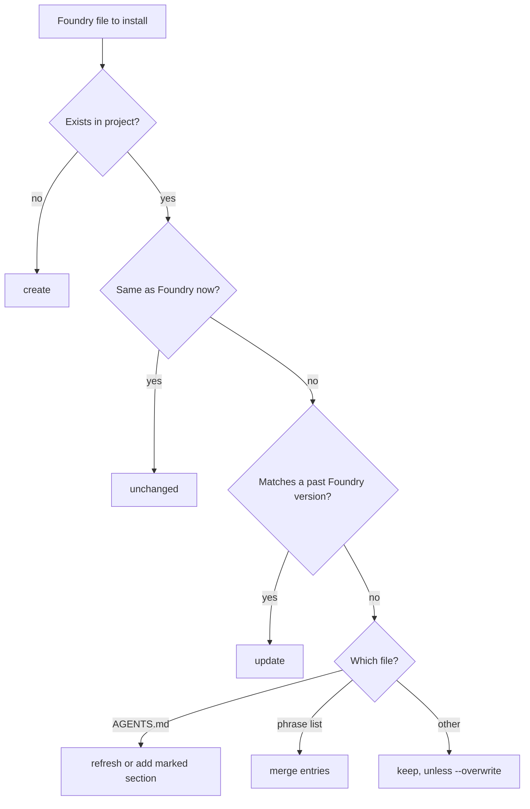

# The installer stops overwriting a project's own work

## What and why

Today the installer copies Foundry's folders straight over a project. Anything there with the same name gets replaced. That is wider than the last handoff said:

- **The project's `AGENTS.md`.** Foundry's own commands tell projects to write their rules there: merge policy, threat classes, start-up checks. A re-run wipes those lines.
- **A project skill that shares a Foundry command's name**, in either tool folder.
- **`scripts/phrase-list.json`.** Wrap-up grows it in the project every session. A re-run resets it to Foundry's list.
- **With `--wiki`, `docs/wiki/INDEX.md` and any Foundry page the project edited.** Wrap-up's distill step edits exactly these.
- **Any project script with the same name as a Foundry checker.**

Your answer at frame-it: keep the project's version. After this change, a run updates a file only when it is still an unedited copy of something Foundry shipped. Anything else stays, and the report names it. A new `--overwrite` flag replaces files on purpose.

Two files get special handling, because simply keeping them would break Foundry:

- **`AGENTS.md`** gets a marked Foundry section. The installer refreshes the text between the markers and never touches anything outside them. A project with its own `AGENTS.md` keeps its lines, and Foundry's section is added below them. Without that section, Cursor and Codex would never load Foundry's rules.
- **The phrase list** is merged. The project keeps every entry it added, and Foundry's new entries are appended.

## The README rewrite

You asked for the README to sound like you, not like an AI wrote it. The source is your personal-writing skill in the Sol Wilds repo: your own calibration document, the worked examples, and the list of AI tells. That skill normally skips repo READMEs. You've tagged this one as yours, so it applies here.

The git history shows that most of the README's personality is already yours. You wrote these lines by hand, and they stay word for word:

- the opening paragraph
- the harness paragraph
- "you (the human)"
- the line about not hovering over a designer every time they push a pixel
- "not your bias"
- the jargon list training your agent "to stop talking gibberish"
- "OG design process name"
- "I HIGHLY recommend"
- the crit's "black hole of logic"
- "Two places you'll want to stay present"
- "the soul of the project"

There's one fix inside your own lines. "In my game Visiblemiles" becomes Sol Wilds, matching the rename you made in the opening.

What gets rewritten is the agent-written prose around those lines:

- **The built-in commands comparison.** It has "So this isn't 'mine beats theirs'", "earns its weight", and "One honest caveat". "Genuinely impressive" stays, because it echoes your own post.
- **The memory and library section.** It's a run of backticked paths and lists of three.
- **The cost section.** It hedges in long clause chains.
- **The session walk-through and the solo paragraph.** They have to read right now that solo exists.
- **The install section.** Today it's one 300-word paragraph. It becomes short prose plus one list of steps, and it describes the new keep-your-files behaviour.
- **The "if you edit anything" section.**

The rules from your calibration that the rewrite follows:

- First person, with contractions.
- Named tools instead of categories.
- State the fact before explaining why it matters.
- No em dashes, no "not X but Y" lines, no lists of three for rhythm, and no closers that try to land.
- Paragraphs are allowed to just stop.
- Your hand-written lines keep their rough edges, because your calibration says to correct confusion, not personality.

Before drafting, the build reads the most recent post in the series the README links to, "Design Process, Meet Agent Process", to set the tone.

The facts stay put. The README still names every stage, still has the exact sentence saying handoff "authorizes the agent to merge a ready pull request" (a test checks that phrase), and every path and link in it still has to resolve.

## Calls I made for you (veto any)

- **How the installer tells "Foundry's copy" from "yours".** It compares the project's file against every version of that file in Foundry's git history. A match means it's an untouched Foundry copy, so it's safe to update. Nothing new is stored in the project. If Foundry was downloaded without git history, only the current version counts, and the report says why some files were kept.
- **Skills are decided by name, across both tool folders.** If either copy of a skill is the project's own, Foundry leaves both alone. The installed command list then leaves that name out, so the project's budget check stops counting the project's skill as Foundry's. The cost: a Foundry skill the project edited also drops out of that count, and the report says so.
- **The budget check counts only Foundry's marked section** of a project's `AGENTS.md`. The 8 KB promise covers Foundry's text. Counting the project's own lines would fail their opt-in check after a few lines of their own.
- **The light path goes inline in `AGENTS.md`**, about 300 bytes. I didn't add the light path page to the install set, because that page links into the wiki, which installs only with `--wiki`. The page stays in Foundry for readers of the README.
- **Damaged markers stop the run before anything is written.** That covers one marker, two pairs, or a pair in the wrong order. Guessing where Foundry's text ends could delete the project's lines.

## Risks

- Merging new phrases into a project's list can turn its jargon check red the first time, if its prose already uses a newly listed phrase. That is the gate doing its job, and the report says to run the check.
- A project that edited an old, unmarked Foundry `AGENTS.md` keeps its edited copy without Foundry's newer rules. The installer can't separate those edits safely, so the report names the file and the `--overwrite` route.

## Taste checkpoints (you eyeball these at the end)

- The wording of the report lines: create, update, merge, keep, remove.
- The two marker lines a project will see in its `AGENTS.md`.
- The README, read top to bottom. Does it sound like you? Solo makes the voice calls on its own, so this is where you overrule them.
- Solo's decision log and pull request description. This is the first real solo run, and only you can judge whether they read well.

## Out of scope

- The command files. Their budget has about 490 bytes left, and this plan changes none of them.
- Changing the CLAUDE.md handling. It already never overwrites.
- A voice pass on the other docs, such as the light path page and the tool notes. Only the README was asked for. The tool notes get just their one factual sentence about the installer changed.

---

## Inputs

- `scripts/install.js`: the whole copy, the classification, and the report.
- `scripts/check-context-budgets.js`: measuring `AGENTS.md`.
- `tests/install.test.js`: existing behaviour to keep. Two tests change on purpose: the re-run test, which now expects `AGENTS.md` to be kept, and the summary-line checks.
- `AGENTS.md`: line 7 points at the light path page. 7216 of 8192 bytes are used.
- `README.md`: the whole file, rewritten. The README lines Simon wrote by hand come from commits cfd98bd, 410fca0, and 0c4e7df (git show, then the hash, then the README).
- Voice sources, read in full before drafting. The first three live in the personal-writing skill of the Sol Wilds game checkout on this machine, in the Sites folder; they're named in words because the link check reads paths as this repo's:
  - its voice-calibration reference, Simon's own document, which wins on any conflict
  - its skill file, specifically the voice fingerprint, the hard structural rules, the AI tells to avoid, the "natural" trap, and the gotchas
  - its examples reference
  - the published post at https://simoncorry.com/blog/2026/07/15/design-process-meet-agent-process
- README constraints from this repo:
  - `tests/handoff-pr-authority.test.js` matches the phrase "authorizes the agent to merge a ready pull request".
  - `scripts/check-links.js` resolves every backticked or bare path. Slash commands from other tools are allowed only from its list: `/goal`, `/init`, `/compact`, `/review`, `/plan`.
  - `scripts/check-jargon.js` scans the README.
- `docs/tool-notes.md`: line 17 mentions re-running the installer.
- The shipped solo plan in `docs/plans/`. Nothing references it.

## Per-file decision



## Program design

```
install.js main
+ foundryVersions(items) -> Map<relPath, Set<blobId>>   one `git log --format= --raw --no-abbrev --no-renames -- items`; empty map (and one note) when git or history is missing
+ blobId(bytes) -> string                                git's "blob <size>\0" sha1 hash (Foundry's repository is sha1, and every clone of it is too)
+ isFoundryCopy(rel) -> boolean
  classify every file (existing loop)
+   skills: group by name over .agents/skills and .claude/skills; keep the whole name if any file in either tree fails isFoundryCopy
+   AGENTS.md: renderAgents(existingText | null) -> { text, action }   refuse before writing when the markers are damaged
+   scripts/phrase-list.json: mergePhrases(projectText, foundryText) -> { text, added }   refuse before writing on JSON the project has damaged
+   scripts/foundry-commands.json: written from the installed names, not copied
  refusals (links, damaged markers, damaged phrase list, a file where Foundry needs a folder or the reverse) -> "nothing written"
- cpSync whole folders
+ per-file mkdirSync + copyFileSync / writeFileSync for create, update, merge
  remove old command copies (last, unchanged)
+ note: new wiki pages missing from a kept docs/wiki/INDEX.md
  summary: created, updated, merged, kept, removed, unchanged

check-context-budgets.js
+ export FOUNDRY_SECTION markers; measure the text between them when both are present, else the whole file
```

The marker lines are plain HTML comments. The start line says the installer replaces everything up to the end line, and that the project's own rules go outside it. `scripts/install.js` imports the markers from the budget checker, so the two scripts can never disagree.

## Build steps (each ends runnable)

Each slice updates the tests it changes the meaning of, and ends with `npm run check` green. The `AGENTS.md` and phrase list special cases arrive in their own slices, so step 2 skips those two files from the generic keep rule rather than making the re-run test flip twice.

1. **Preflight.** Make branch `installer-ownership` from `main`. Copy this plan to `docs/plans/installer-ownership.md` with status IN_PROGRESS. Delete the shipped solo plan. Commit both.
2. **Slice: keep plain files.** Add the git history lookup, `isFoundryCopy`, copying file by file, the `keep` report line, `--overwrite`, and dry-run parity. Classification also catches a path where Foundry needs a folder but the project has a file, or the reverse. That now refuses before anything is written, so the run can't fail halfway. The existing partial-copy test keeps passing and now also asserts nothing was written. Keep the existing refusal for a linked top-level folder, and reword its comment, since `cpSync` no longer explains it.
3. **Slice: skills by name.** Decide each name across both trees, and write the target's `scripts/foundry-commands.json` from the names actually installed, in the generator's exact format (`JSON.stringify(names, null, 2)` plus a newline), so an install that keeps nothing matches Foundry's file byte for byte.
4. **Slice: `AGENTS.md` section.** Cover all six cases:
   - absent: write the marked section
   - well-formed markers: refresh the text between them when it matches a past Foundry version. Otherwise someone edited inside the section (security-scan and start-up both tell the agent to write project rules into `AGENTS.md`), so keep it, with a note to move those lines outside the markers or use `--overwrite`. The section holds Foundry's file byte for byte, so it can be checked against history the same way as any other file.
   - unmarked and matching a past Foundry version: replace it with the marked section
   - unmarked, and a line reads exactly `# Foundry: the working agreement` (all seven past versions carry it): this is an edited old Foundry copy, so keep it, with a note naming `--overwrite`
   - unmarked project file without that line: append the section below the project's text. When the resulting file is over 32,768 bytes, print a note. Codex reads at most 32 KiB of `AGENTS.md` by default (its `project_doc_max_bytes` setting) and cuts the rest without saying so, which here would drop Foundry's section.
   - damaged markers: refuse

   A marker counts only when it's a whole line, ignoring a trailing carriage return, so a mention of it in prose can't be mistaken for one. "Unchanged" compares the target with the rendered marked text, never with Foundry's raw file. Have the budget checker measure the section, with its own case in `tests/check-context-budgets.test.js`.
5. **Slice: phrase list merge.** "Damaged" means exactly what the jargon gate rejects: validate both lists with `assertValidPhraseList` from `scripts/prose-matcher.js`, never a second set of rules. The project's entries come first, in their order. Then come Foundry's entries whose `bad` phrase isn't already there, compared without regard to case. When nothing new is added, the file isn't rewritten and counts as unchanged, so a project's own formatting never churns. The report shows how many were added and a reminder to run the jargon check. With `--overwrite`, the project's list (even a damaged one) is replaced by Foundry's.
6. **Slice: wiki index note** for new Foundry pages a kept index doesn't list.
7. **Light path inline.** Replace the pointer in `AGENTS.md` line 7 with the light shape: every stage still runs, but with two challenge rounds instead of five on each side. Frame-it always stays. It trades away some assurance, with no measured saving, and `/solo light` runs it. Add an install test that reuses the existing link checker rather than a new path parser. The test:
   - installs with `--wiki` into a temp folder
   - adds a `package.json` and the two things the chain creates itself (a `docs/plans/` folder and `docs/sessions/LOG.md`)
   - runs the installed copy of `scripts/check-links.js` (the one that ships, which finds its root from its own location), and expects it to pass

   Measured before the change, that install has 15 dead references. All but one are the two chain-created paths; the other is the light path pointer. The same step fixes the link checker crashing in a project with no `package.json`: it currently throws on reading that file. A missing file now means any `npm run` alias reference is reported as dead.
8. **Docs.** Rewrite the header comment in `scripts/install.js`, including the old "re-runs overwrite on purpose" lines, and the re-run sentence in tool notes.
9. **README rewrite.** This step runs last, so it describes the installer as built. In order:
   - Read the voice sources under Inputs in full.
   - Extract Simon's hand-written lines from the three commits and mark them as fixed text.
   - Redraft every other section in his voice, keeping each fact. List any fact that changes under Deviations.
   - Pipe the draft through `node scripts/voice-gate.js`.
   - Do a separate AI-tells pass against the skill's avoid list and the calibration's "Things I should actively avoid": em dashes, "quietly", "not X but Y" lines, lists of three, recap closers, and clause-chain sentences. Use only those two lists. Simon's published post uses "genuinely" himself, so it isn't banned.
10. Run `npm run check` until it's green.

## Acceptance bars

- A fresh install produces the same files as today. Its `scripts/foundry-commands.json` is identical to Foundry's, and `AGENTS.md` is Foundry's text inside the two markers.
- Re-running over an untouched install of an older version reports updates and keeps nothing. The test fakes the older version with a file whose contents match a past `AGENTS.md` blob in this repo's history.
- A project's own `.agents/skills/solo/SKILL.md` survives install and re-install. Foundry's solo isn't written to either tree, the report says `keep`, and the installed budget check reports 19 files.
- A project's own `AGENTS.md` keeps every byte above Foundry's section across two runs. The second run reports it unchanged. Lines the project adds after the end marker also survive a refresh.
- An unmarked `AGENTS.md` carrying Foundry's title line plus local edits is kept byte for byte, with a note. `--overwrite` turns it into the marked section.
- A second run over a fresh install reports zero updated and zero merged.
- A line added inside Foundry's marked section survives a re-run, with a note. `--overwrite` refreshes the section.
- Damaged markers (one marker, two pairs, a reversed pair) exit 1 with nothing written.
- A grown phrase list keeps the project's entries and gains Foundry's new ones. A damaged list exits 1 with nothing written.
- `--overwrite` replaces every kept file. `--dry-run` reports the same lines prefixed with "would", and writes nothing.
- Every existing install test still passes, apart from the two deliberate updates named under Inputs.
- The link checker passes inside a `--wiki` install that has the chain-created paths, and reports (never crashes) in an install with no `package.json`. `AGENTS.md` stays at or under 8192 bytes.
- README:
  - Zero em dashes.
  - None of the avoid-list words or shapes named in step 9.
  - The install section names Codex's 32 KiB limit wherever it explains the appended section.
  - Every line Simon wrote by hand is present, apart from the Visiblemiles to Sol Wilds fix.
  - Every stage and both optional extras (quiz and solo) are still described.
  - The install section matches the installer's real behaviour: keep, merge, `--overwrite`, and the marked `AGENTS.md` section.
  - The voice gate flags nothing.
- The shipped solo plan is gone and `npm run check` is green.

## Solo run

Frame-it is done: both answers are folded in above. The human types `/solo`, and solo runs the stages below in order. Security-scan applies, because the installer reads and writes files in a project it doesn't own, which counts as outside input. The run ends with nothing carried over. Handoff merges the pull request under solo's limits, and its next-session half says there is nothing left.

- [x] challenge-plan 1 through 5 (plus extra rounds 6 to 8; stopped at the round-8 cap)
- [ ] build-it
- [ ] test-it
- [ ] security-scan
- [ ] challenge-implementation 1 through 5
- [ ] wrap-up (log entry says the session ran solo; distill how the installer tells copies apart into the wiki if it's durable)
- [ ] handoff (merge when solo's merge rule holds; final report only)
- [ ] Human reads the Solo decisions and the pull request description (closes the first-real-run item)

## Demoted-claims tracking

| Round | Claim | Resolution |
|---|---|---|
| 1 | An unmarked `AGENTS.md` that isn't a past Foundry version is always the project's own file, so appending is safe | Wrong for an edited old Foundry copy: appending would put Foundry's rules in twice. Step 4 now detects Foundry's title line and keeps that file instead. |
| 1 | "Same as Foundry now" is a plain comparison with Foundry's file | Not for `AGENTS.md` or the command list, which the installer renders, so re-runs would report "update" forever. Step 4 compares against the rendered text. |
| 1 | Merging the phrase list is harmless on every run | It would reformat the project's file even when nothing is added. Step 5 now leaves the file untouched in that case. |
| 2 | Refreshing Foundry's marked section is always safe | Foundry's own stages tell the agent to write project rules into `AGENTS.md`, and the agent may write them inside the section. Step 4 now refreshes the section only when it matches a past Foundry version, and keeps it with a note otherwise. |
| 3 | The hash helper needs sha256 support | No user story: Foundry's repository is sha1, and a clone keeps its source's hash format. Cut. (Round 5 removed an unchecked claim about GitHub's support.) |
| 3 | A new test should parse the file paths `AGENTS.md` names | The existing link checker already does this for every installed file, through `CHECK_ROOT`. Step 7 reuses it. That also showed the checker crashes without a `package.json`, so step 7 fixes that too. |
| 4 | Appending Foundry's section to a project's own `AGENTS.md` always loads it | Codex reads only 32 KiB of `AGENTS.md` by default and cuts the rest without warning (openai/codex `agents_md.rs`, issue 7138). Step 4 now prints a note when the combined file goes over that limit. |
| 4 | "Genuinely" is an AI tell to strip from the README | Neither of Simon's voice docs lists it, and his published post uses it twice. Removed from the plan's list. |
| 6 | The plan file can be committed at preflight as written | It failed the link check 15 times: markdown links that resolve from `docs/plans/`, bare file names, and paths in the Sol Wilds repo. Fixed in the plan: backticked root paths, and the other repo's files named in words. |
| 6 | The link test should point the checker at the install with an environment setting | The copy that ships finds its root by itself, and running that copy is what proves an installed project works. Step 7 runs the installed copy. |
| 8 | "A damaged phrase list" needs no definition | A list that parses as JSON but holds the wrong shape would slip through a JSON-only check, then fail the project's jargon gate. Step 5 reuses the gate's own validator. |
| 8 | Copying file by file can't fail halfway on ordinary project layouts | A file sitting where Foundry needs a folder, or the reverse, throws partway through the copy. Step 2 now refuses that before writing anything. |
| 1 | Marker detection is straightforward | A prose mention or a Windows line ending could fool a substring match. Step 4 requires whole-line markers that tolerate a trailing carriage return. |

## Solo decisions

- **Fix the link checker's missing-`package.json` crash in this session?** Options: fix it, or leave it out of scope. Chose: fix it. Why: it ships into every installed project, the new install test runs it there, and the human asked for no leftover tasks.
- **Fix Foundry's scripts failing in a CommonJS project?** Options: rename every script so it loads anywhere; make the installer warn; or say nothing. Chose: warn, and leave the rename out. Why: the rename touches every command file, which have 489 bytes of budget left, and it sits outside this session's focus (what the installer may overwrite). Solo only decides inside the focus. This is the one known gap the session leaves, named in the handoff.

## Deviations

- **Slices 2 to 6 landed as one commit.** The plan said each slice ends green on its own. The code forced one shared classification loop, so the slices aren't separable without throwaway scaffolding. Chose: one unit (`ad36414`), with the check green at its end. Lesson: slice by behaviour, but expect slices sharing one loop to land together.
- **A kept skill reports one line per name, not per file.** The plan didn't say. Chose one line naming the skill and saying neither tool copy was installed (`scripts/install.js`, the skills loop), since the decision is per name. Lesson: report at the level the decision is made.
- **Tool notes left as they were.** Step 8 said to rewrite the re-run sentence in `docs/tool-notes.md`. On reading it, the sentence only says re-running clears old command copies, which is still true. Chose: no edit. Lesson: check a sentence is wrong before planning to rewrite it.
- **README facts trimmed.** The plan said keep each fact and list any change here. Dropped: the name of the log-rotation script and its refuse-rather-than-misfile behaviour (still in the wrap-up command and the script's own header), and "the surfaces format" from the wiki-pointer sentence (it's in that script's header). Added: security-scan in the session walk-through, which the old list skipped; the new installer behaviour; and the CommonJS gap. Lesson: a voice rewrite is also a fact audit, so diff the sentences.
- **New note for a CommonJS project.** Not in the plan. Running the installed scripts showed they fail to load in any project whose `package.json` sets `"type": "commonjs"`. The real fix means renaming every script, which reaches the command files with 489 bytes of budget left, so it's outside this focus. Chose: the installer now says so in a note (`scripts/install.js`, the notes block), and the gap is recorded under Solo decisions. Lesson: running shipped scripts inside a real install finds what reading them doesn't.
